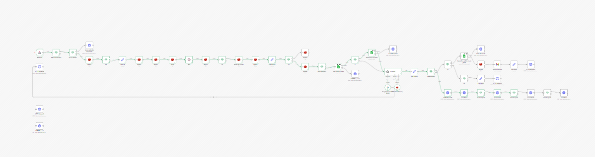

# 🤖 AI-Driven WhatsApp Booking Agent & CRM (n8n + Gemini)

  

## 📌 Visión General del Proyecto
Sistema avanzado de automatización de reservas diseñado para un spa comercial ("Zenter Spa"). Este proyecto orquesta un Agente de Inteligencia Artificial capaz de manejar atención al cliente por WhatsApp 24/7, realizar filtrado de intenciones, consultar disponibilidad en bases de datos relacionales y ejecutar transiciones (*Human Handoff*) hacia asesores humanos sin perder el contexto.

El sistema fue construido con una arquitectura tolerante a fallos, utilizando **n8n** como motor de flujos, **Evolution API** para la integración con WhatsApp, y **Redis** para la gestión de caché y estados de sesión.

## 🛠️ Stack Tecnológico
* **Orquestación:** n8n (Despliegue self-hosted en Railway).
* **LLM / Inteligencia Artificial:** Google Gemini 2.5 Flash (Vía LangChain UI).
* **Gestión de Memoria y Estado:** Redis (Control de sesiones y Window Buffer Memory).
* **Base de Datos & CRM:** Google Sheets API.
* **Mensajería:** Evolution API (WhatsApp Webhooks).
* **Infraestructura:** Railway (Docker/Containers).

## 🚀 Desafíos Técnicos Resueltos

### 1. Gestión de Estado y Control de Concurrencia
* **El Problema:** Evitar que el bot respondiera a mensajes mientras un asesor humano intervenía, o procesar mensajes duplicados si el usuario enviaba varios textos rápidos seguidos.
* **La Solución:** Implementación de un sistema de *Locking* (bloqueo) usando Redis. Se asigna un TTL (Time to Live) a los identificadores de sesión y un estado de "Pausado" en Google Sheets cuando el bot detecta una intención compleja, silenciando el Webhook hasta que el asesor libere el ticket.

### 2. Prompt Engineering Avanzado y Guardrails
* Se diseñó un *System Message* complejo con reglas estrictas de formato y comportamiento.
* **Anti-Alucinaciones:** Se bloquearon variables temporales para que el LLM no prometa horas o fechas sin validación previa en el CRM.
* **Neutralidad de Sesgo:** Se forzó al modelo a eludir suposiciones estadísticas de género, vital para un entorno de spa/bienestar.
* **Enrutamiento Condicional NLP:** El LLM es capaz de distinguir entre consultas de soporte, intención de compra y "casos borde" (ej. convenios externos) para derivar la conversación al nodo correcto.

### 3. Ciberseguridad y Tolerancia a Fallos (Resiliencia)
* **Header Authentication:** El Webhook receptor está protegido mediante tokens de autorización (`X-Token`) inyectados desde Evolution API para prevenir peticiones HTTP maliciosas públicas.
* **Filtros Pre-Procesamiento:** Nodos condicionales (`If/Switch`) bloquean la ejecución ante la recepción de audios (evitando errores nulos en el LLM) y filtran *JIDs* para descartar grupos de WhatsApp (evitando ataques de spam y consumo excesivo de la API).
* **Failover de APIs Externas:** Configuración de reintentos exponenciales en los nodos de Google APIs (Sheets y Gemini) para mitigar errores `503 Service Unavailable` por saturación de red.
* **Telemetría:** Implementación de un "Error Trigger Workflow" secundario para capturar excepciones a nivel de nodo y emitir alertas tempranas por correo electrónico.

## ⚙️ Arquitectura del Flujo (Resumen)

1. **Ingesta:** Webhook (POST) recibe el payload JSON de WhatsApp.
2. **Validación:** Se verifica la procedencia (privado vs. grupo) y el formato (texto vs. audio).
3. **Control de Estado:** Redis verifica si la sesión del usuario actual está en modo manual ("Human Handoff").
4. **Procesamiento de IA:** LangChain Agent + Gemini procesan la intención manteniendo una ventana de contexto de los últimos 6 mensajes (Window Buffer Memory).
5. **Ejecución:** Basado en el output del Agente, el flujo se bifurca: puede actualizar el CRM en Google Sheets, despachar un correo a administración o enviar payloads multimedia (texto + imágenes) de vuelta a Evolution API.

## 👨‍💻 Contacto
* **Ingeniero:** Miguel Santiago Martínez Belalcázar (Consultor de automatización)
* **Ubicación:** Zipaquirá, Cundinamarca, Colombia
* **Email:** miguelmartinezbel@gmail.com
* **LinkedIn:** [Miguel Santiago Martínez B.][(https://www.linkedin.com/in/miguel-santiago-martinez-mb/)]
